<h1 align="center">🌟 Cloud-First Microservices E-Commerce Web Application 🌟</h1>

<p align="center">
  
  
  
  
  
  
  
  
  
  
</p>

**Purely** is a cloud-first microservices e-commerce web application built to showcase production-grade Kubernetes deployments. Users can browse products, add them to a cart, and place orders — all powered by a scalable backend.

- Architecture leverages **Spring Boot microservices**, **Spring Cloud Gateway**, and **Eureka Service Registry**.
- Frontend built with **React.js**, communicating exclusively through the API Gateway.
- Each microservice has its own dedicated **MongoDB** database.
- Containerized with **Docker**, deployed to **AWS EKS** via **Helm**, and automated through **GitHub Actions CI/CD** pipelines.

---

## 📑 Table of Contents

1. [Project Structure](#-project-structure)
2. [Development Setup](#-development-setup)
   - [Component Diagram](#component-diagram)
   - [Frontend](#frontend)
   - [Service Registry](#service-registry)
   - [API Gateway](#api-gateway)
   - [Auth Service](#auth-service)
   - [User Service](#user-service)
   - [Category Service](#category-service)
   - [Product Service](#product-service)
   - [Cart Service](#cart-service)
   - [Order Service](#order-service)
   - [Notification Service](#notification-service)
   - [Communication Between Services](#communication-between-services)
3. [Deployment Setup](#-deployment-setup)
   - [Deployment Diagram](#deployment-diagram)
   - [Containerization](#containerization)
   - [Kubernetes Orchestration](#kubernetes-orchestration)
   - [AWS Infrastructure](#aws-infrastructure)
     - [Networking (AWS VPC)](#networking-aws-vpc)
     - [Kubernetes Cluster (AWS EKS)](#kubernetes-cluster-aws-eks)
   - [Terraform — Infrastructure as Code](#terraform--infrastructure-as-code)
   - [CI/CD with GitHub Actions](#cicd-with-github-actions)
4. [How to Run Locally](#%EF%B8%8F-how-to-run-locally)
5. [How to Deploy to AWS EKS](#%EF%B8%8F-how-to-deploy-to-amazon-eks)
6. [Demo Video](#demo-video)

---

## 📂 Project Structure

```
fullstack-E-commerce-web-application/
├── .github/
│   └── workflows/
│       ├── ci-cd-auth.yml
│       ├── ci-cd-cart.yml
│       ├── ci-cd-category.yml
│       ├── ci-cd-gateway.yml
│       ├── ci-cd-ingress.yml
│       ├── ci-cd-notification.yml
│       ├── ci-cd-order.yml
│       ├── ci-cd-product.yml
│       ├── ci-cd-registry.yml
│       ├── ci-cd-user.yml
│       └── ci-cd-web.yml
├── assets/
├── frontend/
│   ├── nginx/
│   ├── public/
│   ├── src/
│   │   ├── api-service/
│   │   ├── assets/
│   │   ├── components/
│   │   ├── contexts/
│   │   ├── pages/
│   │   ├── routes/
│   │   ├── App.jsx
│   │   └── main.jsx
│   ├── Dockerfile
│   └── index.html
├── helm-charts/
│   ├── api-gateway/
│   ├── auth-service/
│   ├── cart-service/
│   ├── category-service/
│   ├── ingress-alb/
│   ├── notification-service/
│   ├── order-service/
│   ├── product-service/
│   ├── service-registry/
│   ├── user-service/
│   └── web-app/
├── microservice-backend/
│   ├── api-gateway/
│   ├── auth-service/
│   ├── cart-service/
│   ├── category-service/
│   ├── notification-service/
│   ├── order-service/
│   ├── product-service/
│   ├── service-registry/
│   └── user-service/
├── sample-data/
│   ├── purely_category_service.categories.json
│   └── purely_product_service.products.json
└── terraform/
    ├── common-data.tf
    ├── common-provider.tf
    ├── common-variables.tf
    ├── ecr-registries.tf
    ├── eks-access-entries.tf
    ├── eks-alb-controller.tf
    ├── eks-cluster-autoscaler.tf
    ├── eks-cluster.tf
    ├── eks-metrics-server.tf
    ├── eks-node-groups.tf
    ├── eks-openid-connect-provider.tf
    ├── policies/
    │   ├── AWSLoadBalancerControllerIAMPolicy.json
    │   └── EKSClusterAutoscalerIAMPolicy.json
    ├── vpc-internet-gateway.tf
    ├── vpc-nat-gateway.tf
    ├── vpc-route-tables.tf
    ├── vpc-subnets.tf
    └── vpc.tf
```

---

## 👨‍💻 Development Setup

The application is composed of the following independent microservices:

| Service | Description |
|---|---|
| **Service Registry** | Eureka-based registry for dynamic service discovery |
| **API Gateway** | Single entry point routing all client requests |
| **Auth Service** | Handles sign-up, sign-in, and JWT validation |
| **User Service** | Manages user profile data |
| **Category Service** | CRUD operations for product categories |
| **Product Service** | CRUD operations and search for products |
| **Cart Service** | Manages user shopping carts |
| **Order Service** | Places and manages orders |
| **Notification Service** | Sends transactional emails |

### Component Diagram

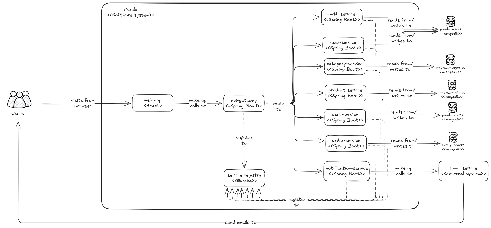

---

### Frontend

The [frontend](./frontend/) is a React.js single-page application. It communicates with all backend services exclusively through the API Gateway and provides a responsive UI for browsing products, managing the cart, and placing orders.

---

### Service Registry

The [Service Registry](./microservice-backend/service-registry/) is a centralized Eureka server that stores information about all running services — including IP addresses, port numbers, and metadata.

As services start, stop, or scale dynamically, they register and deregister themselves automatically, enabling load balancing and resilient inter-service communication.

---

### API Gateway

The [API Gateway](./microservice-backend/api-gateway/) acts as the single entry point for all client requests. It routes incoming traffic to the correct microservice based on predefined rules and integrates with the Service Registry for dynamic routing.

---

### Auth Service

The [Auth Service](./microservice-backend/auth-service/) handles user authentication using JWT tokens.

| Method | Route | Parameters | Description |
|---|---|---|---|
| `POST` | `/auth/signin` | — | User login |
| `POST` | `/auth/signup` | — | User registration |
| `GET` | `/auth/signup/verify` | `code` | Validate OTP from registration email |
| `GET` | `/auth/isValidToken` | `token` | Validate a JWT token |

---

### User Service

The [User Service](./microservice-backend/user-service/) manages user profile data.

---

### Category Service

The [Category Service](./microservice-backend/category-service/) manages product categories.

| Method | Route | Parameters | Description | Auth | Role |
|---|---|---|---|---|---|
| `POST` | `/admin/category/create` | — | Create new category | ✅ | Admin |
| `PUT` | `/admin/category/edit` | `categoryId` | Edit existing category | ✅ | Admin |
| `DELETE` | `/admin/category/delete` | `categoryId` | Delete a category | ✅ | Admin |
| `GET` | `/category/get/all` | — | Get all categories | ❌ | All |
| `GET` | `/category/get/byId` | `categoryId` | Get category by ID | ❌ | All |

---

### Product Service

The [Product Service](./microservice-backend/product-service/) manages the product catalogue.

| Method | Route | Parameters | Description | Auth | Role |
|---|---|---|---|---|---|
| `POST` | `/admin/product/add` | — | Create new product | ✅ | Admin |
| `PUT` | `/admin/product/edit` | `productId` | Edit existing product | ✅ | Admin |
| `GET` | `/product/get/all` | — | Get all products | ❌ | All |
| `GET` | `/product/get/byId` | `productId` | Get product by ID | ❌ | All |
| `GET` | `/product/get/byCategory` | `categoryId` | Get products by category | ❌ | All |
| `GET` | `/product/search` | `searchKey` | Search products by keyword | ❌ | All |

---

### Cart Service

The [Cart Service](./microservice-backend/cart-service/) manages shopping cart operations per user.

| Method | Route | Parameters | Description | Auth | Role |
|---|---|---|---|---|---|
| `POST` | `/cart/add` | — | Add item to cart / update quantity | ✅ | User |
| `GET` | `/cart/get/byUser` | — | Get cart by user | ✅ | User |
| `GET` | `/cart/get/byId` | `cartId` | Get cart by ID | ✅ | User |
| `DELETE` | `/cart/remove` | `productId` | Remove an item from cart | ✅ | User |
| `DELETE` | `/cart/clear/byId` | `cartId` | Clear all items from cart | ✅ | User |

---

### Order Service

The [Order Service](./microservice-backend/order-service/) handles order placement and management.

| Method | Route | Parameters | Description | Auth | Role |
|---|---|---|---|---|---|
| `POST` | `/order/create` | — | Place an order | ✅ | User |
| `GET` | `/order/get/byUser` | — | Get orders by user | ✅ | User |
| `GET` | `/order/get/all` | — | Get all orders | ✅ | Admin |
| `DELETE` | `/order/cancel` | `orderId` | Cancel an order | ✅ | User |

---

### Notification Service

The [Notification Service](./microservice-backend/notification-service/) sends transactional emails to users (e.g., order confirmations, OTP codes).

| Method | Route | Description |
|---|---|---|
| `POST` | `/notification/send` | Send an email |

---

### Communication Between Services

Inter-service HTTP calls are made using **OpenFeign** — a declarative HTTP client for Java that simplifies service-to-service communication within the cluster.

---

## 🚀 Deployment Setup

### Deployment Diagram

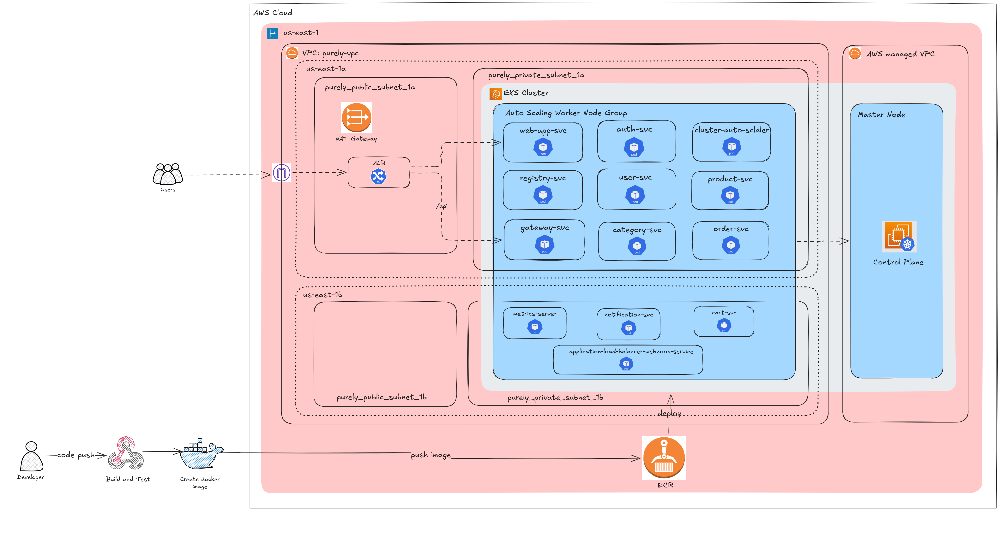

---

### Containerization

- Every component has its own `Dockerfile`: [frontend](./frontend/Dockerfile), [service-registry](./microservice-backend/service-registry/Dockerfile), [api-gateway](./microservice-backend/api-gateway/Dockerfile), and all other [microservices](./microservice-backend/category-service/Dockerfile).
- Docker images are built and pushed to **Amazon Elastic Container Registry (ECR)**.

---

### Kubernetes Orchestration

- Each service is deployed as a separate Helm chart under the [`/helm-charts`](./helm-charts/) directory.
- Each chart contains Kubernetes resources: `Deployment`, `HPA`, `Service`, `ConfigMap`, and `Secrets`.
- All components are deployed with `ClusterIP` service type and exposed externally via an [Ingress ALB](./helm-charts/ingress-alb/).

---

### AWS Infrastructure

#### Networking (AWS VPC)

- A dedicated [VPC](./terraform/vpc.tf) spanning two Availability Zones (AZs).
- [Subnets](./terraform/vpc-subnets.tf):
  - 2 Public subnets (1 per AZ)
  - 2 Private subnets (1 per AZ)
- [Internet Gateway](./terraform/vpc-internet-gateway.tf): Provides internet access for public subnets.
- [NAT Gateway](./terraform/vpc-nat-gateway.tf): Deployed in a public subnet so private-subnet resources (e.g., EKS worker nodes) can reach the internet for pulling images.
- [Route Tables](./terraform/vpc-route-tables.tf):
  - Public route table → Internet Gateway
  - Private route table → NAT Gateway

#### Kubernetes Cluster (AWS EKS)

- [**EKS Cluster**](./terraform/eks-cluster.tf) deployed within the VPC above.
- [**Managed Node Group**](./terraform/eks-node-groups.tf) spread across both AZs for high availability. Worker nodes run in private subnets.
- [**AWS Load Balancer Controller**](./terraform/eks-alb-controller.tf) enables ingress-based traffic routing.
- [**Metrics Server**](./terraform/eks-metrics-server.tf) exposes CPU/memory metrics to the Horizontal Pod Autoscaler (HPA).
- [**Cluster Autoscaler**](./terraform/eks-cluster-autoscaler.tf) dynamically adjusts the number of worker nodes based on pending pod demand.

> **Horizontal Pod Autoscaler (HPA):** Automatically scales the number of pods in a Deployment or ReplicaSet by watching resource metrics from the Metrics Server. Scales up when usage exceeds a threshold, scales down when it drops.

> **Cluster Autoscaler (CA):** Automatically adds nodes when the HPA needs more pods but there are insufficient resources, and removes underutilised nodes to reduce cost.

---

### Terraform — Infrastructure as Code

Infrastructure is fully provisioned via Terraform for reproducibility and automation. Terraform manages:

- **Networking:** [VPC](./terraform/vpc.tf), [subnets](./terraform/vpc-subnets.tf), [Internet Gateway](./terraform/vpc-internet-gateway.tf), [NAT Gateway](./terraform/vpc-nat-gateway.tf), [route tables](./terraform/vpc-route-tables.tf)
- **EKS:** [Cluster](./terraform/eks-cluster.tf), [Node Groups](./terraform/eks-node-groups.tf), [Access Entries](./terraform/eks-access-entries.tf), [Metrics Server](./terraform/eks-metrics-server.tf), [ALB Controller](./terraform/eks-alb-controller.tf), [Cluster Autoscaler](./terraform/eks-cluster-autoscaler.tf)
- **Registries:** [ECR repositories](./terraform/ecr-registries.tf) for storing Docker images

---

### CI/CD with GitHub Actions

- [One workflow file per service](./.github/workflows/) for isolated, independent deployments.
- Each workflow runs three stages:
  1. **Build & Test** — compile and run tests
  2. **Docker Build & Push** — build image and push to ECR
  3. **Helm Deploy** — deploy/upgrade the Helm release on EKS

---

## 🖥️ How to Run Locally

### Prerequisites

Ensure the following tools are installed:

- Java Development Kit (JDK 21)
- Maven
- Node.js & npm
- Git

---

### Step 1: Fork and Clone the Repository

1. Fork the repository to your GitHub account.

2. Clone the forked repository:

```bash
git clone https://github.com/<your-username>/Fullstack-E-commerce-web-application
```

---

### Step 2: Set Up Databases

1. Create the following databases in **MongoDB Atlas**:

   - `purely_auth_service`
   - `purely_category_service`
   - `purely_product_service`
   - `purely_cart_service`
   - `purely_order_service`

2. Seed sample data for products and categories from the [`sample-data/`](./sample-data/) directory.

---

### Step 3: Configure Email (Notification Service)

In the `notification-service`, open [`application.properties`](./microservice-backend/notification-service/src/main/resources/application.properties) and set your email credentials:

```properties
spring.mail.username=YOUR_USERNAME
spring.mail.password=YOUR_PASSWORD
```

---

### Step 4: Run the Microservices

1. Start the [`service-registry`](./microservice-backend/service-registry/) **first**, then start all other services:

```bash
mvn spring-boot:run
```

2. Confirm all services are registered in the Eureka Dashboard at [http://localhost:8761](http://localhost:8761):

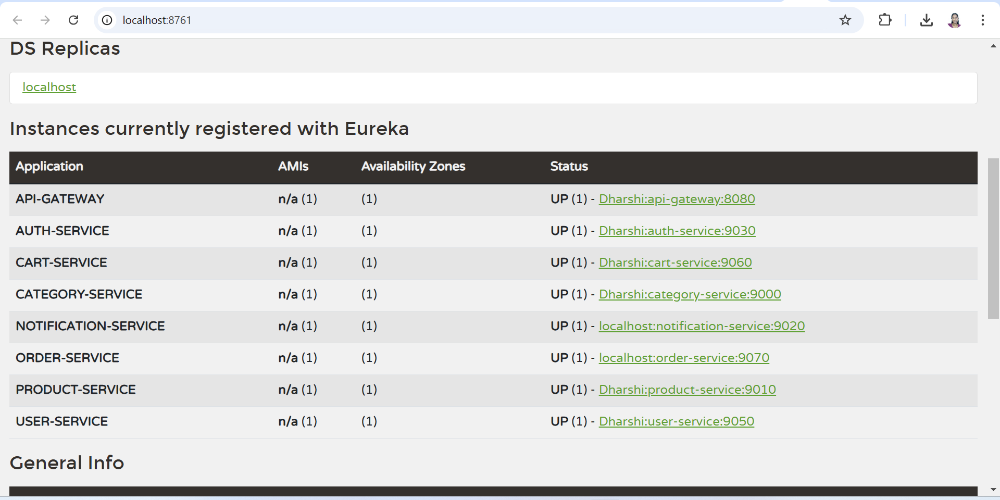

---

### Step 5: Run the Frontend

1. Navigate to the [`frontend/`](./frontend/) directory:

```bash
cd frontend
```

2. Install dependencies:

```bash
npm install
```

3. Update the API base URL in [`apiConfig.jsx`](./frontend/src/api-service/apiConfig.jsx):

```js
const API_BASE_URL = "http://localhost:8080"
```

4. Start the development server:

```bash
npm run dev
```

Access the application at [http://localhost:5173](http://localhost:5173).

---

## ☁️ How to Deploy to Amazon EKS

### Prerequisites

Ensure the following tools are installed:

- `kubectl`
- `helm`
- `aws` CLI
- `eksctl`
- `terraform`

---

### Step 1: Containerization

Each component has its own `Dockerfile`. No manual changes are needed — images are built and pushed to ECR automatically by the CI/CD pipelines.

---

### Step 2: Kubernetes Orchestration

Helm charts under [`/helm-charts`](./helm-charts/) are pre-configured for deployment. No modifications are needed unless you're adding new services.

---

### Step 3: Provision AWS Infrastructure

1. AWS resources are defined in [`terraform/`](./terraform/).

2. EKS requires access entries for any user or role that needs cluster access (e.g., root, GitHub Actions IAM user, local CLI user). Update IAM usernames in [`terraform/common-variables.tf`](./terraform/common-variables.tf). Access entries are defined in [`terraform/eks-access-entries.tf`](./terraform/eks-access-entries.tf).

3. Run Terraform:

```bash
terraform init
terraform plan
terraform apply
```

This provisions the VPC, subnets, Internet Gateway, NAT Gateway, route tables, EKS cluster, node groups, ALB controller, Metrics Server, and Cluster Autoscaler.

Verify the networking layout from `AWS Console → VPC → Resource Map`:

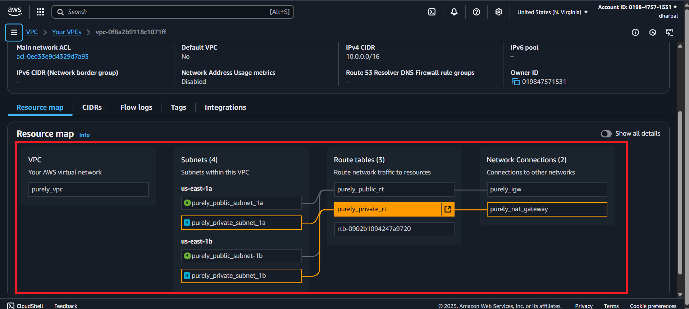

4. After Terraform completes, update your local kubeconfig:

```bash
aws eks update-kubeconfig --region YOUR_REGION --name YOUR_CLUSTER_NAME
```

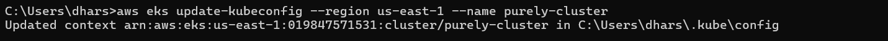

5. Verify cluster components are running:

```bash
kubectl get all -n kube-system
```

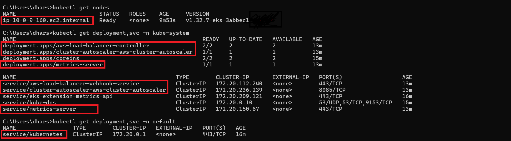

---

### Step 4: Configure CI/CD with GitHub Actions

1. **Create an IAM user** with ECR and EKS permissions, and add it as an access entry in the EKS cluster.

2. **Add the following secrets** to your GitHub repository:

| Secret | Value |
|---|---|
| `AWS_ACCESS_KEY_ID` | IAM user access key |
| `AWS_REGION` | e.g. `us-east-1` |
| `AWS_SECRET_ACCESS_KEY` | IAM user secret access key |
| `ECR_AUTH_REPOSITORY` | `purely_auth_registry` |
| `ECR_CART_REPOSITORY` | `purely_cart_registry` |
| `ECR_CATEGORY_REPOSITORY` | `purely_category_registry` |
| `ECR_GATEWAY_REPOSITORY` | `purely_gayeway_registry` |
| `ECR_NOTIFICATION_REPOSITORY` | `purely_notification_registry` |
| `ECR_ORDER_REPOSITORY` | `purely_order_registry` |
| `ECR_PRODUCT_REPOSITORY` | `purely_product_registry` |
| `ECR_REGISTRY_REPOSITORY` | `purely_service_registry` |
| `ECR_USER_REPOSITORY` | `purely_user_registry` |
| `ECR_WEB_REPOSITORY` | `purely_web_registry` |
| `EKS_CLUSTER` | `purely-cluster` |
| `SPRING_DATA_MONGODB_URI_AUTH` | MongoDB Atlas URI for auth service |
| `SPRING_DATA_MONGODB_URI_CART` | MongoDB Atlas URI for cart service |
| `SPRING_DATA_MONGODB_URI_CATEGORY` | MongoDB Atlas URI for category service |
| `SPRING_DATA_MONGODB_URI_ORDER` | MongoDB Atlas URI for order service |
| `SPRING_DATA_MONGODB_URI_PRODUCT` | MongoDB Atlas URI for product service |
| `SPRING_MAIL_PASSWORD` | Email app password |
| `SPRING_MAIL_USERNAME` | Email address |

3. Trigger the workflow for each service from the **GitHub Actions** tab. Once complete, all services will be live in your EKS cluster.

---

### ✅ Verify the Deployment

**Nodes**

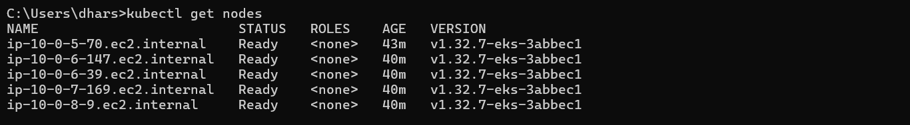

**Deployments**

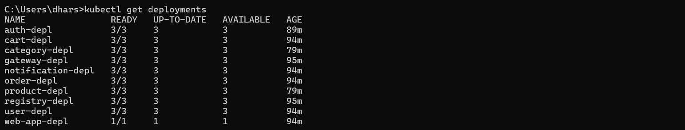

**Horizontal Pod Autoscaler**

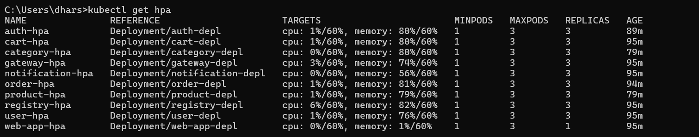

**Services**

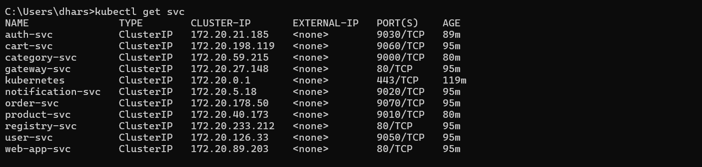

**Ingress**

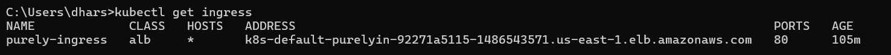

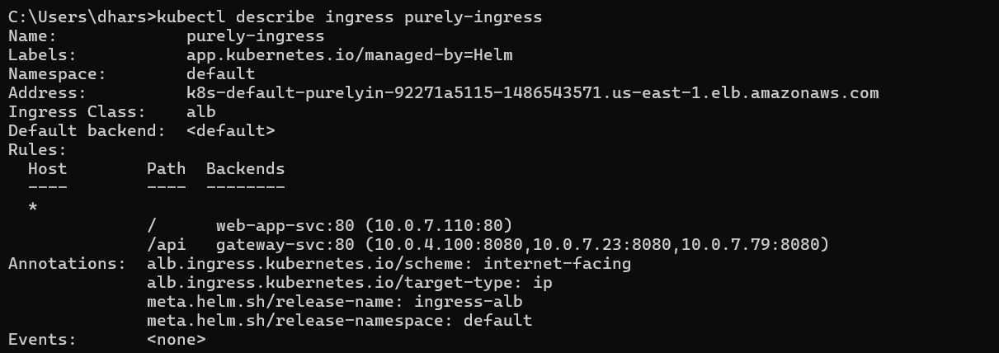

**Eureka Server (via port-forwarding)**

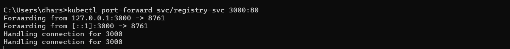

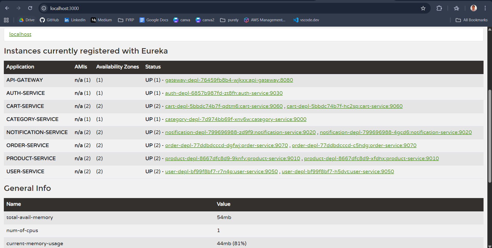

Copy the Ingress DNS address from `kubectl get ingress` and open it in your browser to access the live application.

---

## Demo Video

https://github.com/user-attachments/assets/d648cb16-6008-44b0-ad2a-b6752df40702
