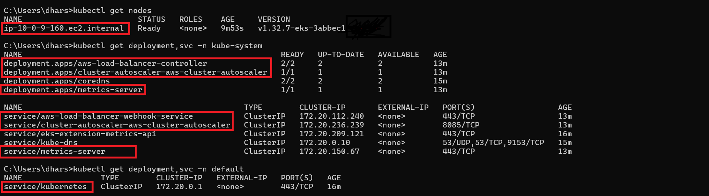
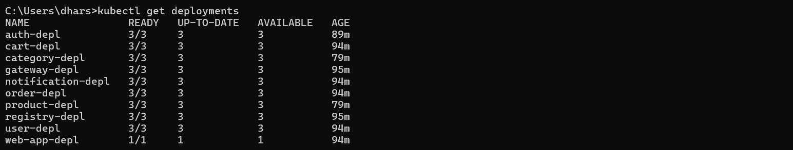

<h1 align="center">🌟 Cloud first microservices e-commerce web application 🌟</h1>

<p align="center">
  
  
  
  
  
  
  
</p>

- Purely is a cloud-first microservices web application showcasing Kubernetes. The application is a web-based e-commerce app where users can browse items, add them to the cart, and purchase them.
- The architecture leverages **Spring Boot microservices**, **Spring Cloud Gateway**, and **Eureka Service Registry**, with a **React.js frontend** and **MongoDB databases**. 
- The solution is containerized and deployed to **AWS Elastic Kubernetes Service (EKS)** using **Helm** and automated via **GitHub Actions CI/CD** pipelines.

# 📑 Table of contents

1.  [Project Tree](#-project-tree)
2.  [Development Set up](#-development-set-up)
    - [Component Diagram](#-component-diagram)
    - [Frontend](#-frontend)
    - [Service Registry](#%EF%B8%8F-service-registry)
    - [Api Gateway](#-api-gateway)
    - [Auth Service](#-auth-service)
    - [Category Service](#%EF%B8%8F-category-service)
    - [Product Service](#-product-service)
    - [Cart Service](#-cart-service)
    - [Order Service](#%EF%B8%8F-order-service)
    - [Notification Service](#-notification-service)
    - [Communication between services](#-communication-between-services)
3. [Deployment Set up](#-deployment-set-up)
    - [Deployment Diagram](#-deployment-diagram)
    - [Containerization](#-containerization)
    - [Kubernetes Orchestration](#-kubernetes-orchestration)
    - [AWS Infrastructure](#%EF%B8%8F-aws-infrastructure)
      - [Networking (AWS VPC)](#-networking-aws-vpc)
      - [Kubernetes Cluster (AWS EKS)](#%EF%B8%8F-kubernetes-cluster-aws-eks)
      - [Ingress Routing](#-ingress-routing)
    - [Terraform - Infrastructure as Code](#%EF%B8%8F-terraform-infrastructure-as-code)
    - [CI/CD with GitHub Actions](#-cicd-with-github-actions)
4. [How to run locally?](#%EF%B8%8F-how-to-run-locally)
5. [How to deploy to AWS?](#%EF%B8%8F-how-to-deploy-to-amazon-eks)
6. [Demo video](#-demo-video)

# 📂 Project tree

```
.github/
    └── workflows/
        ├── ci-cd-auth.yml
        ├── ci-cd-cart.yml
        ├── ci-cd-category.yml
        ├── ci-cd-gateway.yml
        ├── ci-cd-ingress.yml
        ├── ci-cd-notification.yml
        ├── ci-cd-order.yml
        ├── ci-cd-product.yml
        ├── ci-cd-registry.yml
        ├── ci-cd-user.yml
        └── ci-cd-web.yml
frontend/
    ├── public/
    ├── src/
        ├── api-service/
        ├── assets/
        ├── components/
        ├── contexts/
        ├── pages/
        ├── routes/
        ├── App.jsx
    ├── Dockerfile
    ├── package.json
helm-charts/
    ├── api-gateway/
    ├── auth-service/
    ├── cart-service/
    ├── category-service/
    ├── ingress-alb/
    ├── notification-service/
    ├── order-service/
    ├── product-service/
    ├── service-registry/
    ├── user-service/
    └── web-app/
microservice-backend/
    ├── api-gateway/
    ├── auth-service/
    ├── cart-service/
    ├── category-service/
    ├── notification-service/
    ├── order-service/
    ├── product-service/
    ├── service-registry/
    └── user-service/
sample-data/
    ├── purely_category_service.categories.json
    └── purely_product_service.products.json
terraform/
    ├── data.tf
    ├── ecr_registry.tf
    ├── eks_access_entry.tf
    ├── eks_cluster.tf
    ├── eks_node_group.tf
    ├── internet_gateway.tf
    ├── nat_gateway.tf
    ├── provider.tf
    ├── route_tables.tf
    ├── subnets.tf
    ├── variables.tf
    └── vpc.tf
.gitignore
LICENSE
README.md
```

# 👨‍💻 Development set up

- **Microservices Architecture**: Independent services for User, Auth, Product, Category, Cart, Order, and Notification.
- **Service Discovery**: Centralized Eureka Service Registry manages dynamic discovery of microservices within the cluster. Simplifies communication and load balancing between services.
- **API Gateway**: Built using Spring Cloud Gateway. Acts as the single entry point for all client requests.
- **Frontend**: Developed in React.js, providing a responsive user interface. Communicates with the backend exclusively via API Gateway.
- **Databases**: Each microservice uses a dedicated MongoDB database.
  
## 📊 Component Diagram 


## 💻 Frontend 

## 🗂️ Service Registry

- The <a href="./microservice-backend/service-registry">Service Registry</a> serves as a centralized repository for storing information about all the available services in the microservices architecture. 

- This includes details such as IP addresses, port numbers, and other metadata required for communication.

- As services start, stop, or scale up/down dynamically in response to changing demand, they update their registration information in the Service Registry accordingly.

## 🚪 API Gateway

- The <a href="./microservice-backend/api-gateway">API gateway</a> acts as a centralized entry point for clients, providing a unified interface to access the microservices.

- API gateway acts as the traffic cop of our microservices architecture. It routes incoming requests to the appropriate microservice, or instance based on predefined rules or configurations.


## 🔒 Auth Service

- The <a href="./microservice-backend/auth-service">Auth Service</a> is responsible for securely verifying user identities and facilitating token-based authentication.

| HTTP Method | Route Path | Parameters | Description |
|----------|----------|----------|----------|
|  | `/auth/signin`   | - | User login |
|  | `/auth/signup`   | - | User registration   |
|  | `/auth/signup/verify`   | code | Validate registration one time password code |
|  | `/auth/isValidToken`   | token | Validate json web token  |


## 🏷️ Category Service

- The <a href="./microservice-backend/category-service">Category Service</a> provides centralized data management and operations for product categories.

| HTTP Method | Route Path | Parameters | Description | Authentication | Role | 
|----------|----------|----------|----------| ----------| ----------|
|  | `/admin/category/create`   | - | Create new category | Yes | Admin |
|  | `/admin/category/edit`   | categoryId | Edit existing category | Yes | Admin |
|  | `/admin/category/delete`   | categoryId | Delete existing category | Yes | Admin |
|  | `/category/get/all`   | - | Get all categories | No | Admin/User/Non user |
|  | `/category/get/byId`   | categoryId | Get category by id | No |  Admin/User/Non user  |

## 📦 Product Service

- The <a href="./microservice-backend/product-service">Product Service</a> provides centralized data management and operations for available products.

| HTTP Method | Route Path | Parameters | Description | Authentication | Role (Admin/User) | 
|----------|----------|----------|----------| ----------| ----------|
|  | `/admin/product/add`   | - | Create new product | Yes | Admin |
|  | `/admin/product/edit`   | productId | Edit existing product | Yes | Admin |
|  | `/product/get/all`   | - | Get all products | No |  Admin/User/Non user  |
|  | `/product/get/byId`   | productId | Get product by id | No |  Admin/User/Non user  |
|  | `/product/get/byCategory`   | categoryId | Get product by category | No |  Admin/User/Non user  |
|  | `/product/search`   | searchKey | Search products by key | No |  Admin/User/Non user  |

## 🛒 Cart Service

- The <a href="./microservice-backend/cart-service">Cart Service</a> provides centralized data management and operations for user carts.

| HTTP Method | Route Path | Parameter | Description | Authentication | Role (Admin/User) | 
|----------|----------|----------|----------| ----------| ----------|
|  | `/cart/add`   | - | Add item to cart, update quantity | Yes | User |
|  | `/cart/get/byUser` | - | Get cart details by user | Yes | User |
|  | `/cart/get/byId` | cartId | Get cart details by cart id | Yes | User |
|  | `/cart/remove`   | productId | Remove an item from the cart | Yes | User |
|  | `/cart/clear/byId`   | cartId | Remove all the items from the cart | Yes | User |

## 🛍️ Order Service

- The <a href="./microservice-backend/order-service">Order Service</a> provides centralized data management and operations for orders.

| HTTP Method | Route Path | Parameter | Description | Authentication | Role (Admin/User) | 
|----------|----------|----------|----------| ----------| ----------|
|  | `/order/create`   | - | Place an order | Yes | User |
|  | `/order/get/byUser` | - | Get orders by user | Yes | User |
|  | `/order/get/all`   | - | Get all orders | Yes | Admin |
|  | `/order/cancel`   | orderId | Cancel the order | Yes | User |

## 🔔 Notification Service

- The <a href="./microservice-backend/notification-service">Notification Service</a> provides centralized operations for send emails to user.

| HTTP Method | Route Path | Description | 
|----------|----------|----------|
|  | `/notification/send`   | Send email | 

## 💬 Communication between services

- OpenFeign, a declarative HTTP client library for Java, is used to simplify the process of making HTTP requests to other microservices.
  
# 🚀 Deployment set up

## 📊 Deployment Diagram


## 🐳 Containerization

- Each component (frontend, service-registry, api-gateway, and microservices) has its own Dockerfile, and is packaged into a Docker image.
- Images pushed to **Amazon Elastic Container Registry (ECR)**.

## ⚓ Kubernetes Orchestration

- Each service is deployed as a separate Helm chart under [`/helm-charts`](`/helm-charts`) directory.
- Each chart includes Kubernetes resources: `Deployment`, `Service`, `ConfigMaps`, and `Secrets`.
- All components (frontend, service-registr, api-gateway, and microservices) deployed as `ClusterIP` service type.

## ☁️ AWS Infrastructure

### 🌐 Networking (AWS VPC)

- A dedicated VPC across two Availability Zones (AZs).
- Subnets:
  - 2 Public subnets (1 in each AZ).
  - 2 Private subnets (1 in each AZ).
- Internet Gateway: Attached to VPC for public subnet access for public subnets.
- NAT Gateway: Deployed in one public subnet, allowing outbound internet access for resources in private subnets (e.g., EKS worker nodes pulling Docker images).
- Route Tables:
  - Public route table routes internet-bound traffic via Internet Gateway.
  - Private route table routes internet-bound traffic via NAT Gateway.

### ☸️ Kubernetes Cluster (AWS EKS)

- EKS Cluster deployed within the above VPC.
- EKS Node Group (managed worker nodes) spread across the two AZs for high availability.
- Worker nodes are deployed in private subnets, ensuring they are not exposed directly to the internet.

### ➡️ Ingress Routing

- Dedicated Helm chart for ingress configuration.
- Configured via AWS Load Balancer Controller.
- Routing strategy:
  - `/` → React frontend service
  - `/api/**` → Spring Cloud API Gateway service
- Public access is restricted to the Ingress Controller only.

## 🏗️ Terraform (Infrastructure as Code)

- Infrastructure provisioned using Terraform, ensuring reproducibility and automation.
- Terraform manage:
  - VPC (subnets, route tables, IGW, NAT Gateway).
  - EKS Cluster (control plane and managed node groups).
  - IAM Roles and Policies (for worker nodes and control plane).
  - ECR Repositories for storing Docker images.

## 🔄 CI/CD with GitHub Actions

- Separate workflow files per service for isolation and independent deployments.
- Workflow stages:
  - Build & test
  - Build Docker image and push to ECR
  - Deploy/update Helm release on EKS

# 🖥️ How to run locally?

## 📋 Prerequistics

Make sure you have the following tools installed locally:
- JAVA Development Kit (JDK 21)
- Maven
- Node.js
- npm
- Git
  
## Step 1: Fork and Clone the Repository

1. Fork the repository to your GitHub account.

2. Clone the forked repository to your local machine.

```bash
git clone https://github.com/<your-username>/Fullstack-E-commerce-web-application
```


## Step 2: Setting up databases.

1. Create the following databases in MongoDB Atlas:

- `purely_auth_service`
- `purely_category_service`
- `purely_product_service`
- `purely_cart_service`
- `purely_order_service`

2. You can find sample data for products and categories to get started [here](./sample-data/).

## Step 3: Setting up e-mail configurations

1. In the `notification-service`, configure the following credentials in the [`application.properties`](./microservice-backend/notification-service/src/main/resources/application.properties) file to enable email sending functionality:

```properties
spring.mail.username=YOUR_USERNAME
spring.mail.password=YOUR_PASSWORD
```

Replace `YOUR_USERNAME` and `YOUR_PASSWORD` with your actual email service credentials.

## Step 4: Run the microservices.

1. First run [`service-registry`](./microservice-backend/service-registry/). Access the Eureka dashboard at [`http://localhost:8761`](http://localhost:8761). Next run the other services. 

```
mvn springboot:run
```

2. Make sure all the services are up and running in the [Eureka Dashboard](http://localhost:8761) as below.
   


## Step 5: Run the frontend

1. Navigate to [frontend direcory](./frontend/).
```
cd ./frontend
```

2. Install dependencies.
```
npm install
```

3. Update API_BASE_URL in [`apiConfig.js`](/frontend/src/api-service/apiConfig.jsx).

```js
const API_BASE_URL =  "http://localhost:8080"
```

3. Run the app.
```
npm run dev
```

Access the application at [`http://localhost:5173/`](http://localhost:5173/)

# ☁️ How to deploy to Amazon EKS?

## 📋 Prerequistics

Make sure you have the following tools installed locally:
- kubectl
- Helm
- AWS CLI
- ekctl
- Terraform

## Step 1: Containerization

- Each component (frontend, service-registry, api-gateway, and microservices) has its own Dockerfile.
- You don’t need to change anything here. The components will be automatically built and push images to Amazon ECR when running CI/CD.
  
## Step 2: Kubernetes Orchestration

- Each service is deployed as a separate Helm chart under [`/helm-charts`](`/helm-charts`) directory. Leave them as that.
- No need to modify the chart structure unless adding new services or debugging purposes.

## Step 3: AWS Infrastructure  

- AWS resources are provisioned using Terraform manifests in the [`terraform/`](terraform/) directory.
- By default, you can’t directly access an eks cluster without the **AmazonEKSClusterAdminPolicy**.
  - For each user who needs access (root, GitHub Actions IAM user, local AWS CLI user), you must create an access entry in the cluster.
  - In this project:  Access entries are defined in [`terraform/eks_access_entry.tf`](terraform/eks_access_entry.tf).
  - Update IAM usernames for GitHub Actions and local CLI in [terraform/variables.tf](terraform/variables.tf).

- Then, Run the following commands:
  
```
terraform init
terraform plan
terraform apply
```

- This will create a VPC, subnets (2 public, 2 private), an Internet Gateway, a NAT Gateway, and route tables. You can verify the networking setup from `AWS console > VPC > Resource Map`.


- This will deploy an EKS cluster (purely-cluster) and associated EKS node groups across two Availability Zones. You can verify the cluster setup from `AWS console > EKS >  clusters > purely-cluster`.


- After Terraform finishes, update your kubeconfig (Ensure the local AWS CLI user has an access entry in the EKS cluster.):
```
aws eks update-kubeconfig --region YOUR_REGION --name YOUR_CLUSTER_NAME
```


- Verify cluster resources:
```
kubectl get svc
```



- For ingress routing, the AWS Load Balancer Controller is installed. To install the controller, check [this](https://docs.aws.amazon.com/eks/latest/userguide/lbc-helm.html) guide.

- After installation verify whether the controller instances are running.


## Step 4: CI/CD with GitHub Actions

- IAM User for CI/CD
  - Create an IAM user with permissions to EKS and ECR.
  - Ensure this user has an access entry in the EKS cluster.
- Add the following secrets to your GitHub repository:

| Secret | Value |
| ------- | -------- |
| `AWS_ACCESS_KEY_ID` | Access key of IAM user|
| `AWS_REGION` | `us-east-1` (unless you’re using a different AWS region) |
| `AWS_SECRET_ACCESS_KEY` | Secret access key of IAM user |
|`ECR_AUTH_REPOSITORY`| `purely_auth_registry` (unless you're using a different name for ECR repository of Auth service) |
| `ECR_CART_REPOSITORY` | `purely_cart_registry` (unless you're using a different name for ECR repository of Cart service) |
| `ECR_CATEGORY_REPOSITORY` | `purely_category_registry` (unless you're using a different name for ECR repository of Category service) |
| `ECR_GATEWAY_REPOSITORY` | `purely_gayeway_registry` (unless you're using a different name for ECR repository of API Gateway) |
| `ECR_NOTIFICATION_REPOSITORY` | `purely_notification_registry` (unless you're using a different name for ECR repository of Notification service) |
| `ECR_ORDER_REPOSITORY` | `purely_order_registry` (unless you're using a different name for ECR repository of Order service) |
| `ECR_PRODUCT_REPOSITORY` |  `purely_product_registry` (unless you're using a different name for ECR repository of Product service) |
| `ECR_REGISTRY_REPOSITORY` | `purely_service_registry` (unless you're using a different name for ECR repository of Service Registry)  |
| `ECR_USER_REPOSITORY` | `purely_user_registry` (unless you're using a different name for ECR repository of User service)  |
| `ECR_WEB_REPOSITORY` | `purely_web_registry` (unless you're using a different name for ECR repository of Frontend)  |
| `EKS_CLUSTER` |  `purely-cluster` (unless you're using a different name for EKS cluster) |
| `SPRING_DATA_MONGODB_URI_AUTH` | Database URI of auth service from MongoDB Atlas |
| `SPRING_DATA_MONGODB_URI_CART` |  Database URI of cart service from MongoDB Atlas |
| `SPRING_DATA_MONGODB_URI_CATEGORY` | Database URI of category service from MongoDB Atlas |
| `SPRING_DATA_MONGODB_URI_ORDER` | Database URI of order service from MongoDB Atlas |
| `SPRING_DATA_MONGODB_URI_PRODUCT` | Database URI of product service from MongoDB Atlas |
| `SPRING_MAIL_PASSWORD` | Your mail app password  |
| `SPRING_MAIL_USERNAME` | Your mail |

- Each service has its own workflow file (ensuring isolation). Trigger workflows from GitHub Actions. Once completed, services will be live in your EKS cluster.

✅ Deployment Complete!

Verify cluster resources:

```
kubectl get pod,svc,ingress
```



Copy the Ingress DNS address from the output and open it in your browser to view the live application.


# Demo video

https://github.com/user-attachments/assets/659f4c17-dcf7-44b4-8504-d05826f251b1


